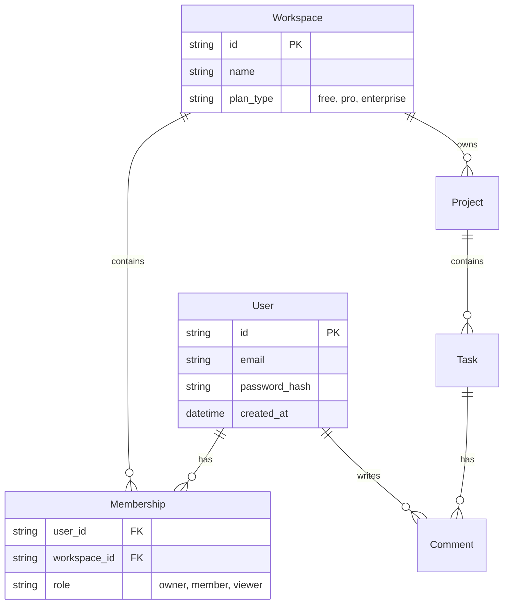

# 🗄️ Data Model

> "How our entities relate to each other."

## 1. Entity Relationship Diagram (ERD)

## 2. Key Entities

### 👤 User
-   **Source of Truth**: `users` table.
-   **Key Constraints**: Email must be unique.

### 🏢 Workspace
-   **Source of Truth**: `workspaces` table.
-   **Key Constraints**: `plan_type` defaults to "free".

### 📋 Task
-   **Source of Truth**: `tasks` table.
-   **Key Constraints**: `status` enum (`todo`, `in_progress`, `done`).

---

## 3. Data Lifecycle

-   **Retention**: Deleted tasks are "soft deleted" (kept for 30 days) before permanent removal.
-   **Archival**: Projects inactive for > 1 year are moved to cold storage.
